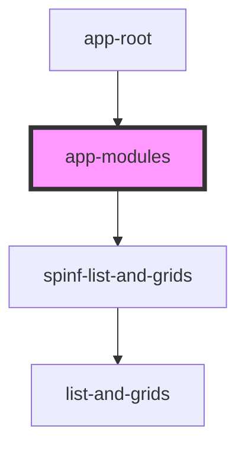

# app-modules

<!-- Auto Generated Below -->

## Properties

| Property         | Attribute          | Description | Type     | Default |
| ---------------- | ------------------ | ----------- | -------- | ------- |
| `currentSubPage` | `current-sub-page` |             | `string` | `''`    |

## Events

| Event           | Description | Type                  |
| --------------- | ----------- | --------------------- |
| `subNavigation` |             | `CustomEvent<string>` |

## Shadow Parts

| Part           | Description |
| -------------- | ----------- |
| `"spinf-card"` |             |

## Dependencies

### Used by

 - [app-root](../app-root)

### Depends on

- [spinf-list-and-grids](../modules-library/list-and-grids)

### Graph

----------------------------------------------

*Built with [StencilJS](https://stenciljs.com/)*
