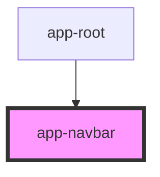

# app-navbar

<!-- Auto Generated Below -->

## Properties

| Property      | Attribute      | Description | Type     | Default         |
| ------------- | -------------- | ----------- | -------- | --------------- |
| `currentPage` | `current-page` |             | `string` | `'componentes'` |

## Events

| Event        | Description | Type                  |
| ------------ | ----------- | --------------------- |
| `navigation` |             | `CustomEvent<string>` |

## Dependencies

### Used by

 - [app-root](../app-root)

### Graph

----------------------------------------------

*Built with [StencilJS](https://stenciljs.com/)*
