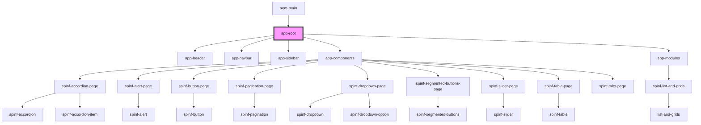

# app-root

<!-- Auto Generated Below -->

## Dependencies

### Used by

 - [aem-main](../..)

### Depends on

- [app-header](../app-header)
- [app-navbar](../app-navbar)
- [app-sidebar](../app-sidebar)
- [app-components](../app-components)
- [app-modules](../app-modules)

### Graph

----------------------------------------------

*Built with [StencilJS](https://stenciljs.com/)*
