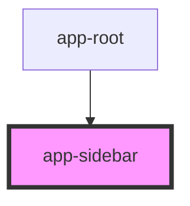

# app-sidebar

<!-- Auto Generated Below -->

## Properties

| Property         | Attribute          | Description | Type     | Default         |
| ---------------- | ------------------ | ----------- | -------- | --------------- |
| `currentPage`    | `current-page`     |             | `string` | `'componentes'` |
| `currentSubPage` | `current-sub-page` |             | `string` | `''`            |

## Events

| Event           | Description | Type                  |
| --------------- | ----------- | --------------------- |
| `subNavigation` |             | `CustomEvent<string>` |

## Dependencies

### Used by

 - [app-root](../app-root)

### Graph

----------------------------------------------

*Built with [StencilJS](https://stenciljs.com/)*
