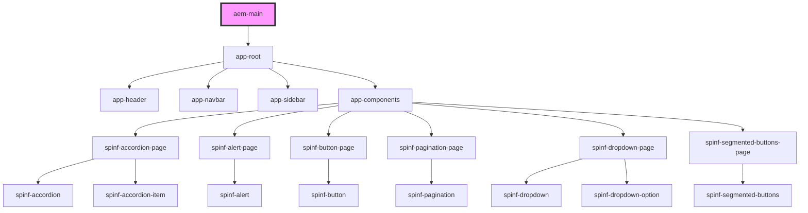

# aem-main

<!-- Auto Generated Below -->

## Dependencies

### Depends on

- [app-root](./components/app-root)

### Graph

----------------------------------------------

*Built with [StencilJS](https://stenciljs.com/)*
